# Ames Housing Regression Analysis

## **Introduction**

This Streamlit application empowers you to explore the Ames Housing Dataset, a comprehensive collection of residential property sales in Ames, Iowa. Using a trained machine learning model, you can interactively predict housing prices based on various features like living area, number of bedrooms, and overall quality. Additionally, the app provides visualizations to help you uncover relationships between different housing attributes and their impact on sale price.

## Running the Project

**1. Requirements**

* Python 3.12
* Streamlit (`pip install streamlit`)
* Pandas (`pip install pandas`)
* Pickle (`pip install pickle`) - for loading the pre-trained model
* Plotly (`pip install plotly`) - for interactive charts
* Numpy (`pip install numpy`)
* Matplotlib (`pip install matplotlib`)
* Seaborn (`pip install seaborn`) - Heatmaps
* Scikit-learn (`pip install scikit-learn`)
* xgboost (`pip install xgboost`)
* statsmodels  (`pip install statsmodels`)

**2. Running with Docker**

(Assuming you have Docker installed)

* Build the Docker image:

```docker build -t housing-app .```

* Run the container:

```docker run -p 8501:8501 housing-app```

Open http://localhost:8501 in your web browser to access the Streamlit app.

**3. Running Locally**

* Clone this repository.

* Install the required libraries (pip install -r requirements.txt).

* Run the app using:

```streamlit run Housing_app.py```

## Navigating the App

Once the app is running, you will see the left side of the screen will have a navigation bar.

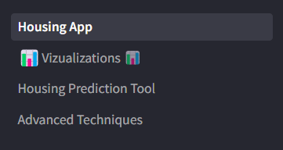

You will start on the "Housing App" page which will display summary information on the data, features, model, and scaling functions used. 

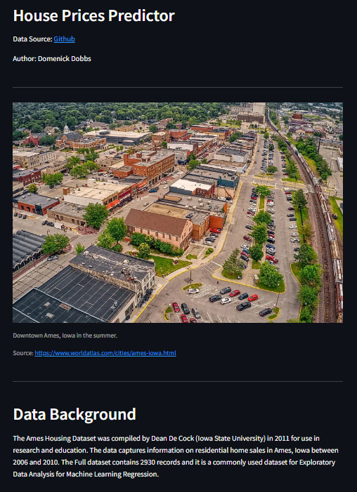

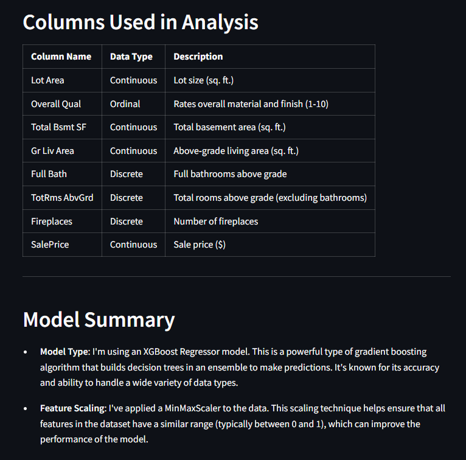

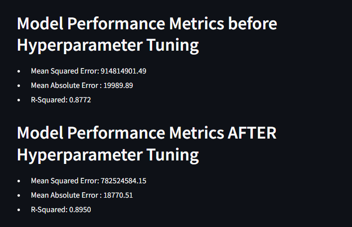

---

Naviagting to the visualization page will display a searchable dataframe that will count the number of results from each search. Below that there will be various plots to represent the data in relation to the Sale Price of the home and Feature Importance. 

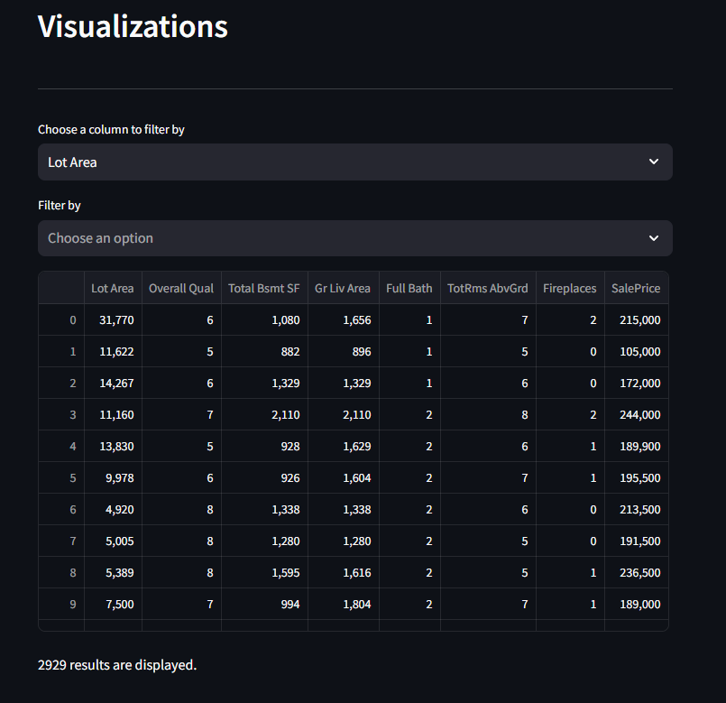

---

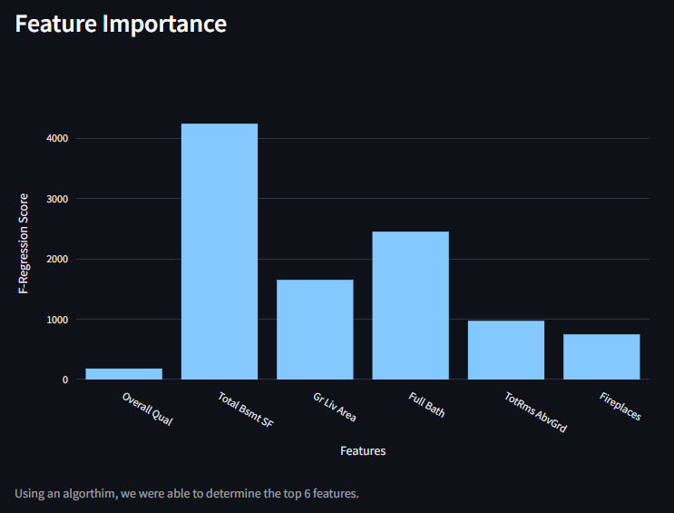

After running an algorithm to determine feature importance, this was the result.

---

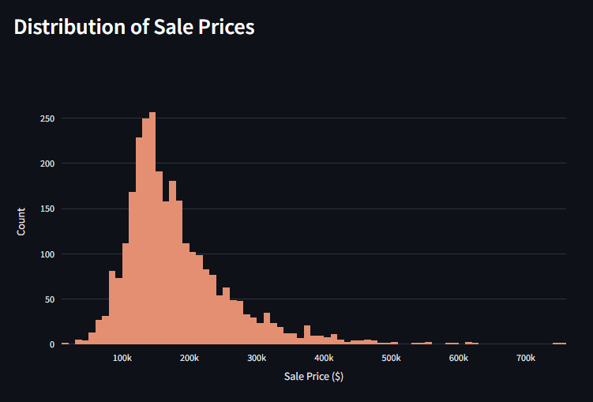

This shows the distribution of housing sale prices. 

---

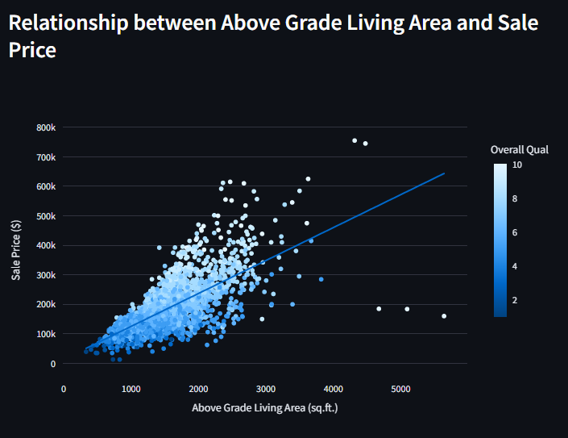

This shows a linear relationship between the above grade living area and the sale price. 

---

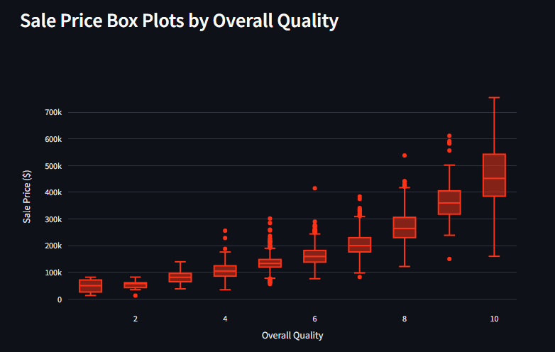

Box Plot displaying the outliers and median/mean sale price by quality.

---

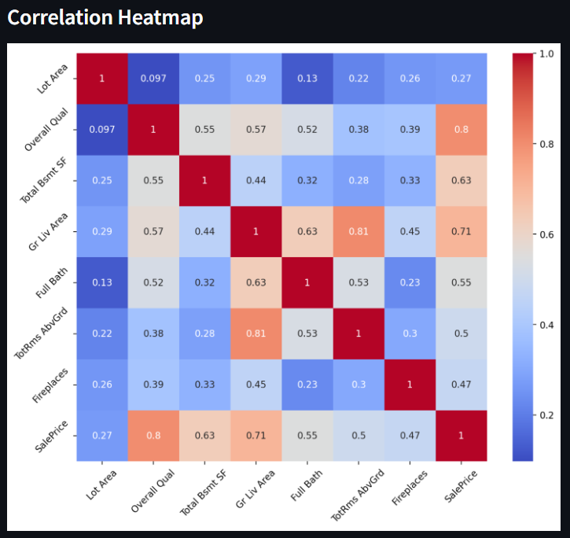

On this heatmap, we want to focus on the SalePirce Correlation on the bottom row to answer our problem and feed our model stronger correlated data. This will help with more accurate predictions. 

---

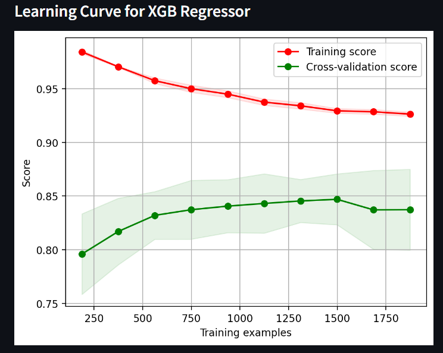

This learning curve is showing a high degree of variance, currently. We want to try to reduce this variance. 

---

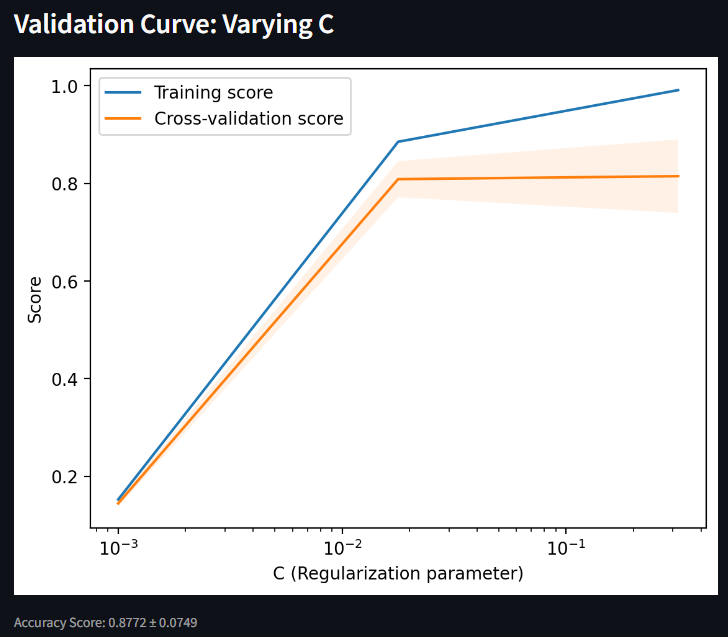

This validation curve shows the cross validation, visually. 

---

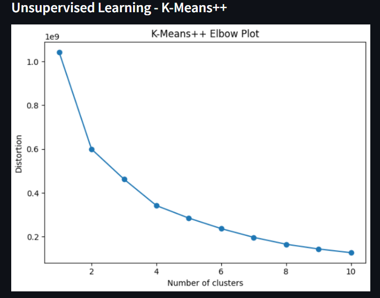

This is teh elbow plot from trainging a model with K-Means++. Normally we see a more define elbow which tells us how many clusters are in the data. This model does not require labels and is amazing for discovering hidden trends in the data. 

---

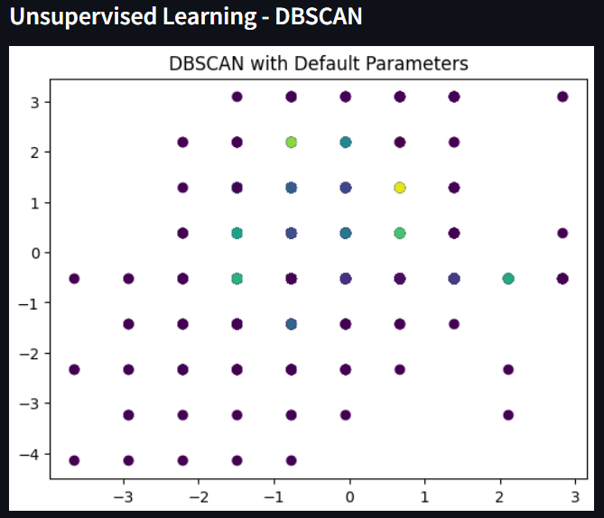

This plot represents the output from the unsupervised model - DBSCAN. 

---

The prediction tool has a few sliders that will allow you to input your own data. By giving it your Lot Area, Overall Building Quality, Total Basement Square Footage, Above Grade Living Area, Bathrooms, Rooms above Grade, and Fireplaces; we can predict with 88% accuracy what the home's Saleprice would be during this period. 

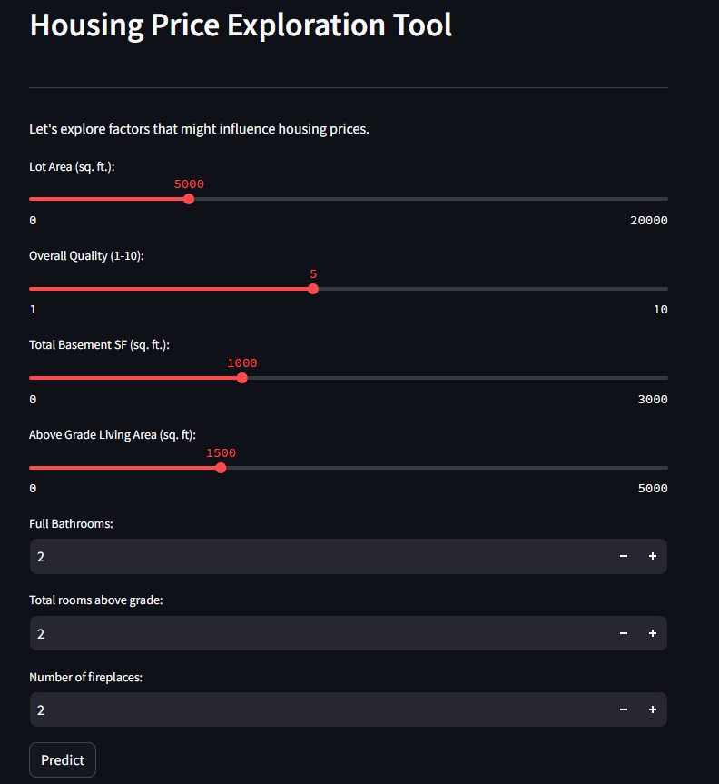


Once the button is pressed, it will show a number based on the features given as to what the model believe is the right Sales Price. 

---

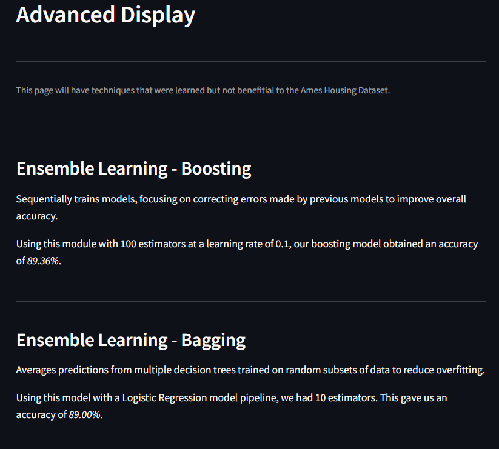

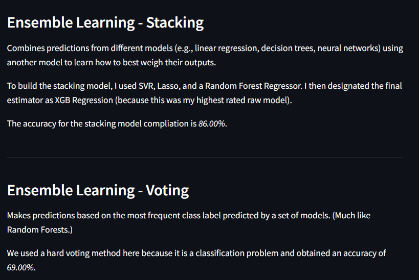

---

## Conclusions

* The Features that had the largest impact of the Sale Price are: Above-grade living area (sq. ft.), Rates overall material and finish and Total basement area (sq. ft.).

* Surprisingly, the size of the lot did not play as large a role in the Sale Price as previously thought.

* The majority of homes were prices between $100k and $300k. Numbers became fewer the higher the price. 

* Overall Quality was the feature that was surprising. Higher quality did not always mean higher prices. People often paid more for less. 
