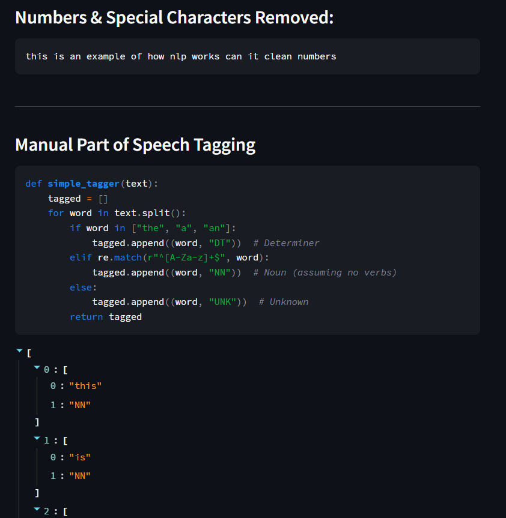

# Natural Language Processing IMDB Project

This Streamlit app provides an interactive comparison of PyTorch and TensorFlow, two popular deep learning frameworks, using the MNIST handwritten digit dataset as a benchmark.

### Features

* **Interactive NLP Text Preprocessing:**
    * Displays preprocessing with and without NLTK.
    * Explains LDA

### How to Use

1. **Clone the Repository:**
   ```bash
   git clone https://github.com/DomenickD/DataScience-IEX-USF/tree/main/NLP/IMDB_App
   cd IMDB_App
   ```

2. **Install Dependencies:**
    ```bash
    pip install -r requirements.txt
    ```
3. **Run the App:**
    ```bash
    streamlit run IMDB_App.py
    ```

**Purpose**

This app is designed to teach and explain NLP and demonstrate the text preprocessing process. 

---


---


---


---


---


---



---


---


---


---


---


---


---


---


---


---


---


---


---


---


---


---


---


---