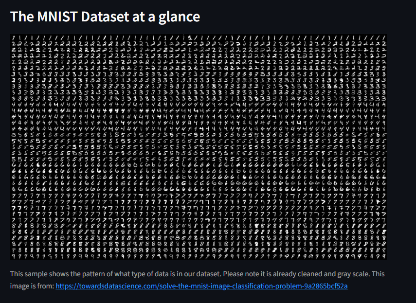

## MNIST Framework Showdown: PyTorch vs. TensorFlow

This Streamlit app provides an interactive comparison of PyTorch and TensorFlow, two popular deep learning frameworks, using the MNIST handwritten digit dataset as a benchmark.

### Features

* **Side-by-Side Model Training:**
    * Train simple neural network models (with customizable hyperparameters) in both PyTorch and TensorFlow.
    * Visualize the training progress (loss and accuracy) for each framework simultaneously.
* **Performance Comparison:**
    * See a clear comparison of training time, final accuracy, and loss for each framework.
    * Evaluate model performance on the test set.
* **Image Visualization:**
    * Display sample images from the MNIST dataset to visualize the task.
* **Framework Information:**
    * Brief summaries of PyTorch and TensorFlow, highlighting their strengths and differences.

### How to Use

1. **Clone the Repository:**
   ```bash
   git clone https://github.com/DomenickD/DataScience-IEX-USF/tree/main/Neural_Networks
   cd Neural_Networks
   ```

2. **Install Dependencies:**
    ```bash
    pip install -r requirements.txt
    ```
3. **Run the App:**
    ```bash
    streamlit run Neural_Networks.py
    ```

**Purpose**

This app is designed for Curious Learners to explore how the same model behaves differently in each framework.

**Acknowledgements**
-MNIST dataset: Yann LeCun, Corinna Cortes, Christopher J.C. Burges.

-PyTorch: Facebook's AI Research lab (FAIR).

-TensorFlow: Google Brain.

---


---


---



---


---


---


---


---


---


---


This is the screenshot for tensorboard displaying a *pytorch* made Neural Network.

---


---


---


---


This is the screenshot for tensorboard displaying a *tensorflow* made Neural Network.

---


